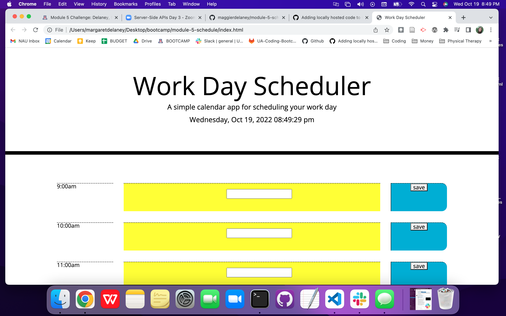
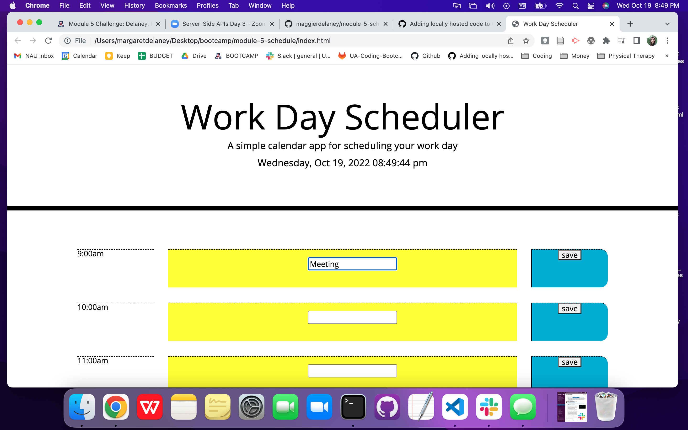
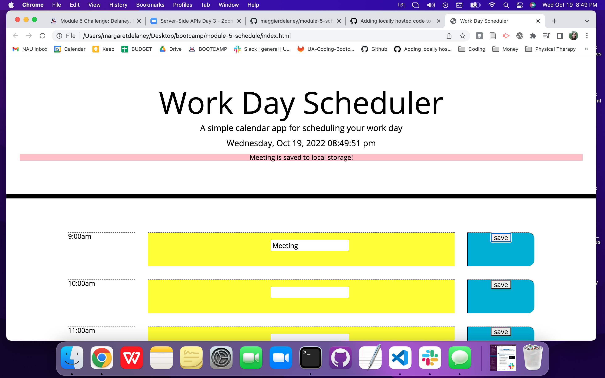

# Third-Party APIs: Work Day Scheduler

## Description

This project provided starter code which was used to create a work day scheduler using HTML, CSS, jQuery and other resources such as Moment.js.

The following acceptance criteria are addressed in this homework:

- GIVEN I am using a daily planner to create a schedule, WHEN I open the planner, THEN the current day is displayed at the top of the calendar
  - Located on the page jumbotron, you will see the current day of the week, date and time displayed in real time

- WHEN I scroll down, THEN I am presented with timeblocks for standard business hours
  - When you scroll down, you will be presented with business hours on the left-hand side, blocks for text in the middle, and a save button on the right-hand side. This was formatted utilizing bootstrap layout features. If you re-size the screen, you will see the hours and savae buttons remain at 2/12 portion of the screen, and the text content with be 8/12 of the screen

- WHEN I view the timeblocks for that day, THEN each timeblock is color coded to indicate whether it is in the past, present, or future
  - My attempts to make the time blocks change color based on the time of day was not successful, and it is likely that the way my HTML was set up contributed to this issue

- WHEN I click into a timeblock, THEN I can enter an event
  - In each time block there is a box for text input where an event can be enetered

- WHEN I click the save button for that timeblock, THEN the text for that event is saved in local storage, WHEN I refresh the page, THEN the saved events persist
  - The save button allows for the event to be saved to local storage on the page, and it persists after the save button is clicked. In this activity, I was not able to get the text to persist after the page was refreshed

## Installation

I first began with settin gup my HTML which contained 3 separate divs: the hour label, text box, and save buttons.

All jQuery and bootstrap was linked in the HTML.

I then worked on getting the date and time to display in the jumbotron using moment.js and setInterval.

From there I created variables for each text input box and save button so that each separate hour could work with local storage upon an event listener for the save button.

## Usage

The home screen of the page is as follows:

  
 
You will type your calendar item into one of the boxes:

  

Click "save" button to save the appointment to local storage. A notification will appear at the top of the page to indicate if it has been saved:

  

## Credits

- Bootstrap layout: https://getbootstrap.com/docs/4.0/layout/grid/
- Moment.js for time formatting: https://momentjs.com/

## License

MIT License

Copyright (c) 2022 maggierdelaney

Permission is hereby granted, free of charge, to any person obtaining a copy
of this software and associated documentation files (the "Software"), to deal
in the Software without restriction, including without limitation the rights
to use, copy, modify, merge, publish, distribute, sublicense, and/or sell
copies of the Software, and to permit persons to whom the Software is
furnished to do so, subject to the following conditions:

The above copyright notice and this permission notice shall be included in all
copies or substantial portions of the Software.

THE SOFTWARE IS PROVIDED "AS IS", WITHOUT WARRANTY OF ANY KIND, EXPRESS OR
IMPLIED, INCLUDING BUT NOT LIMITED TO THE WARRANTIES OF MERCHANTABILITY,
FITNESS FOR A PARTICULAR PURPOSE AND NONINFRINGEMENT. IN NO EVENT SHALL THE
AUTHORS OR COPYRIGHT HOLDERS BE LIABLE FOR ANY CLAIM, DAMAGES OR OTHER
LIABILITY, WHETHER IN AN ACTION OF CONTRACT, TORT OR OTHERWISE, ARISING FROM,
OUT OF OR IN CONNECTION WITH THE SOFTWARE OR THE USE OR OTHER DEALINGS IN THE
SOFTWARE.